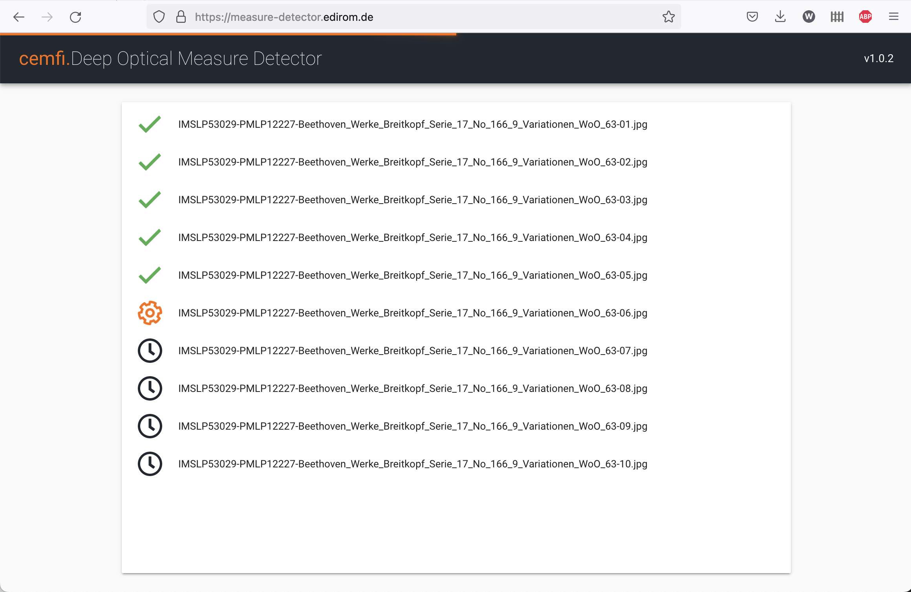

# mei-friend facsimile support

The [facsimile element](https://music-encoding.org/guidelines/v4/elements/facsimile) contains image information of the written notation source. mei-friend is able to display this information (given that the graphical sources are available online), to edit the zones (change size, pan, insert, delete) and ingest facsimile information of a skeleton MEI file (such as exported from [Deep Optical Measure Detector](https://measure-detector.edirom.de/), [Github repository](https://github.com/OMR-Research/MeasureDetector)) to a given MEI file.

## Explore an MEI file with facsimile information
To demonstrate the functionality, please load our example file [Beethoven WoO57 Andante favori](https://mei-friend.mdw.ac.at/?notationOrientation=top&notationProportion=.6&facsimileOrientation=left&facsimileProportion=.45&breaks=line&file=https://raw.githubusercontent.com/trompamusic-encodings/Beethoven_Op76_BreitkopfHaertel/master/Beethoven_Op76-Breitkopf-Haertel.mei) from our public-domain github repository. Upon opening, the facsimile panel will be activated automatically that shows the image information provided in the MEI file. The facsimile panel can be hidden through the close bottom on the right side of the facsimile menu, and shown again using the facsimile icon in the upper right corner of mei-friend. The facsimile source images may be linked through `<graphic@target>` and can be provided as absolute URLs or as paths relative to the github repository's root folder or in an image folder `img`.

### Adjusting the facsimile display

To zoom the displayed image, use the slider in the above menu or `CTRL - mouse wheel` (on MacOS `CMD - mouse wheel`). To change the relative position of the facsimile panel relative to the notation, use the View – Facsimile top/bottom/left/right in the mei-friend control menu. Drag the borders to adjust the size of the facsimile panel. All these settings will be stored in the local storage and restored after the mei-friend is reloaded. By default, only the zones corresponding to the displayed measures in the notation panel are shown. If you want to see the entire page, please activate `Show full page` in the facsimile menu.

### Navigating with facsimile

Click on zone boxes to highlight them; linked element in encoding will be highlighted... Click into measure elements and the corresponding zone gets highlighted.

## Creating your own MEI file with facsimile information

### Editing a skeleton file
To create an MEI file with facsimile information, you may use [Deep Optical Measure Detector](https://measure-detector.edirom.de/), an online tool that detects zones in notation images for each measure. This tool accepts individual images and outputs a skeleton (empty) minimal MEI file (statically named 'measure_annotations.xml') containing empty measures with the corresponding coordinates in the separate zone elements inside facsimile. 

To edit this skeleton file, please activate `Edit zones` in the facsimile menu. You now may adjust the size and position of existing zones. You may insert new zones by click-dragging on the image. It will insert an new zone and a new measure after the currently selected zone. Selected zones (and their references measure element) may be deleted using the `DEL` key.
### Obtaining a fixed number of measures

To generate unique measure numbers (`measure@n`), select `Continue across incomplete measures` and `Continue across endings` in `mei-friend settings – Renumber measures` in your skeleton file. 

### Ingesting facsimile into an MEI file

Open your target MEI file and make sure that it has the same number of measure elements and the identical measure numbering (`measure@n`) as the skeleton file, because mei-friend is comparing this attribute to add a `@facs` attribute to each measure. Click on `Manipulate – Ingest facsimile` and select the skeleton file. After the ingestion, you may re-number your measures as you like, using the provided functionality in the mei-friend settings. Attention: Make sure that the body element of your target MEI file has an `xml:id` attribute before ingestion.

